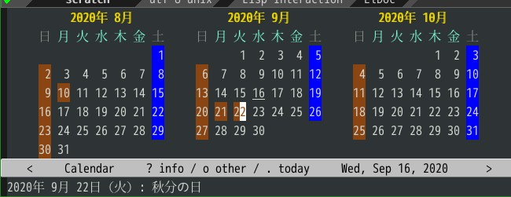

# japanese-holidays.el

このプログラムは、Emacs の [calendar](https://www.gnu.org/software/emacs/manual/html_node/emacs/Calendar_002fDiary.html) に、日本の祝日を表示できるように設定するものです。

<kbd>M-x calendar</kbd> で起動します。



## Getting Started

使用するには `japanese-holidays.el` を `load-path` の通った所に置き、
`~/.emacs.d/init.el` に以下の設定を追加します。

```elisp
(with-eval-after-load "holidays"
  (require 'japanese-holidays)
  (setq calendar-holidays ; 他の国の祝日も表示させたい場合は適当に調整
        (append japanese-holidays holiday-local-holidays holiday-other-holidays))
  (setq calendar-mark-holidays-flag t)	; 祝日をカレンダーに表示
  ;; 土曜日・日曜日を祝日として表示する場合、以下の設定を追加します。
  ;; デフォルトで設定済み
  (setq japanese-holiday-weekend '(0 6)	   ; 土日を祝日として表示
        japanese-holiday-weekend-marker	   ; 土曜日を水色で表示
        '(holiday nil nil nil nil nil japanese-holiday-saturday))
  (add-hook 'calendar-today-visible-hook 'japanese-holiday-mark-weekend)
  (add-hook 'calendar-today-invisible-hook 'japanese-holiday-mark-weekend))
```

## 便利な設定

  - “きょう” をマークするには、次の設定を追加します。

  ```elisp
  (add-hook 'calendar-today-visible-hook 'calendar-mark-today)
  ```

  - "月" の表記を日本の書式とするには、次の設定を追加します。

  ```elisp
  (setq calendar-month-name-array ["1月" "2月" "3月"  "4月"  "5月"  "6月"
                                   "7月" "8月" "9月" "10月" "11月" "12月"]
        calendar-month-header '(propertize
                                (format "%d年 %s" year (calendar-month-name month))
                                'font-lock-face 'calendar-month-header))
  ```

  - 曜日の表記を日本の書式とするには、次の設定を追加します。

  ```elisp
  (setq calendar-day-header-array ["日" "月" "火" "水" "木" "金" "土"])
  ```

  - ポイントの移動先が祝日であれば、同時にエコーエリアに表示する。

  ```elisp
  (defun my/japanese-holiday-show (&rest _args)
    (let* ((date (calendar-cursor-to-date t))
      (date-string (calendar-date-string date))
        (holiday-list (calendar-check-holidays date)))
    (when holiday-list
      (message "%s: %s" date-string (mapconcat #'identity holiday-list "; ")))))

  (add-hook 'calendar-move-hook 'my/japanese-holiday-show)
  ```
